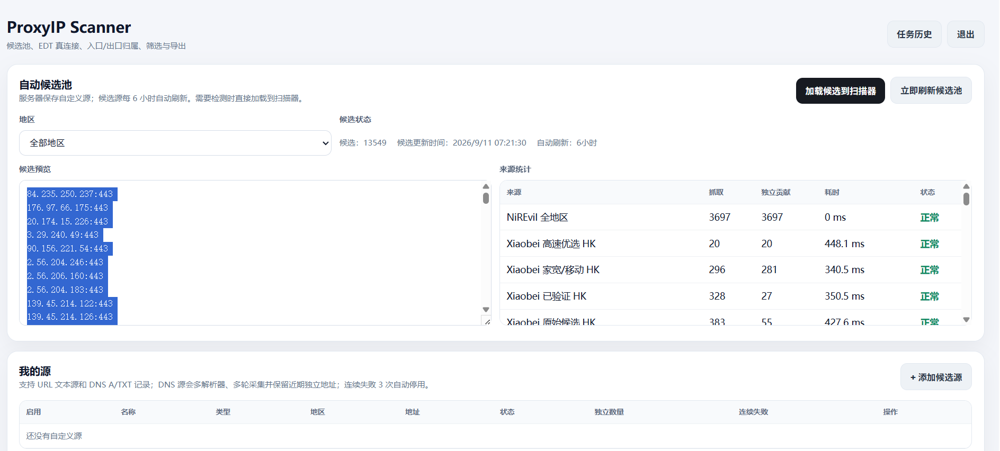
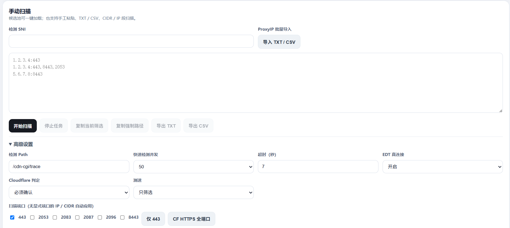
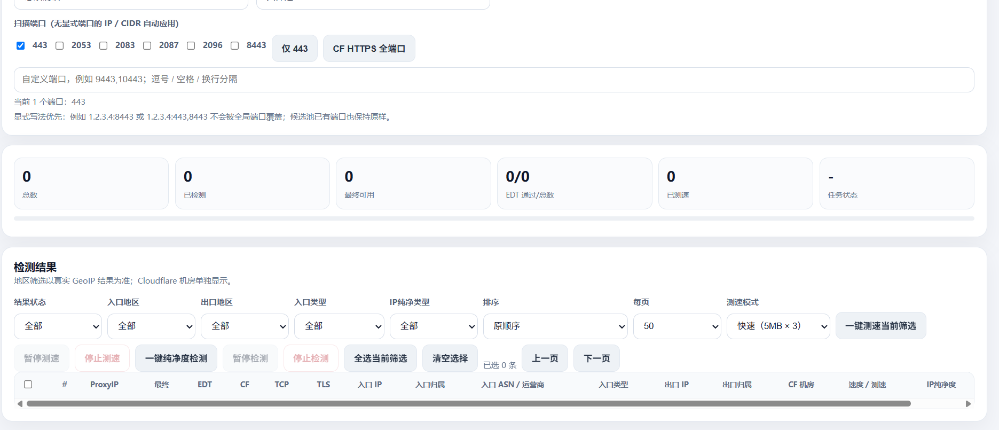

# ProxyIP Scanner

一个面向 Linux VPS 的自托管 ProxyIP 扫描、筛选与验证平台，支持批量候选导入、TCP / TLS / HTTP 分阶段检测、Cloudflare 出口识别、测速、IP 地理信息、纯净度辅助判断、任务历史与 EDT 集成。

项目以 **VPS 直连扫描** 为核心，不依赖 Cloudflare Worker raw TCP；默认仅监听本机 `127.0.0.1:8788`，适合通过 Cloudflare Tunnel、反向代理或其他受控入口访问。

当前公开版本：**v1.0.0**

- [完整安装说明](INSTALL.md)
- [更新记录](CHANGELOG.md)
- [安全策略](SECURITY.md)
- [v1.0.0 Release Notes](docs/release-v1.0.0.md)
- [个人非商业许可](LICENSE)

> **许可提示：** 本项目源码公开供个人免费、非商业使用。未经单独书面授权，禁止任何商业使用，包括收费 SaaS / API / 托管服务、收费部署或维护、商业产品集成，以及公司、工作室或其他营利主体的内部业务使用。详见 [LICENSE](LICENSE)。本项目不是 OSI 定义的开源软件。

## 功能特性

- 批量导入 IP、CIDR 与 `IP:PORT` 目标
- 多端口扫描与显式端口优先
- TCP → TLS/SNI → HTTP 分阶段可用性验证
- 可选第二 SNI 验证
- `/cdn-cgi/trace` 出口 IP、国家、Colo 解析
- 入口 IP / 出口 IP 一致性识别
- EDT 真连接验证与远程验证模式
- 可选测速、重复测速与并发控制
- IP 地理信息与纯净度辅助判断
- 候选池、区域 / ASN / ISP 等筛选能力
- 任务暂停、恢复、中断恢复、取消与历史记录
- 大任务低内存处理与 7 天默认历史保留
- CSV / TXT 导出
- 管理员登录、HttpOnly / Secure / SameSite Cookie、CSRF 与登录失败限速
- systemd 安装、升级、卸载与健康检查脚本

## 界面预览

### 候选池与来源管理

自动聚合候选源，查看来源统计、地区分布与候选预览，并可一键加载到扫描器。



### 扫描与高级参数

支持手动粘贴、TXT / CSV 导入、CIDR / IP 段、多端口扫描、SNI、检测路径、并发、超时、Cloudflare 判定与 EDT 真连接等参数。



### 结果分析与测速

扫描结果支持入口 / 出口地区、ASN / 运营商、Cloudflare 机房、测速与 IP 纯净度等维度筛选与分析。



## 设计与安全原则

- 扫描由 VPS 直接发起，不依赖 Cloudflare Worker raw TCP。
- 可用性检测不写死个人服务器、域名或私有探针地址。
- 检测 SNI、路径及运行参数由任务配置或 EDT 调用动态传入。
- 扫描历史、登录配置、Token 和本机密钥仅保存在部署服务器，不进入 Git。
- 默认仅监听 `127.0.0.1:8788`，不建议直接向公网开放该端口。
- 拒绝私网、回环和保留地址作为扫描目标，降低被滥用为内网探测入口的风险。

## 系统要求

推荐：

- Ubuntu 24.04 LTS / Debian 系 Linux
- Python 3.10+
- systemd
- Git

## 快速安装

```bash
sudo -i
git clone https://github.com/jasonrong0130/proxyip-scanner.git /opt/proxyip-scanner
cd /opt/proxyip-scanner
bash install.sh
```

安装脚本会安装所需依赖、创建 Python 虚拟环境、生成本机 Session Secret 与 EDT API Token、创建 systemd 服务并执行健康检查。

完整部署、升级、卸载和排障说明见 [INSTALL.md](INSTALL.md)。

服务管理：

```bash
systemctl status proxyip-scanner
systemctl restart proxyip-scanner
journalctl -u proxyip-scanner -f
```

更新：

```bash
cd /opt/proxyip-scanner
bash update.sh
```

卸载：

```bash
cd /opt/proxyip-scanner
bash uninstall.sh
```

## Cloudflare Tunnel

Scanner 默认保持监听：

```text
127.0.0.1:8788
```

如需通过 Cloudflare Tunnel 暴露 Web 控制台，可在 Cloudflare Zero Trust 中创建专用 Tunnel，并把公共主机名指向：

```text
http://127.0.0.1:8788
```

随后在 VPS 执行：

```bash
cd /opt/proxyip-scanner
bash install-cloudflare-tunnel.sh
```

Tunnel Token 仅应保存在服务器本机环境文件中

## EDT 集成

单节点验证接口：

```http
POST /api/integrations/edt/check
Authorization: Bearer <EDT_API_TOKEN>
Content-Type: application/json
```

请求示例：

```json
{
  "proxyip": "1.2.3.4:443",
  "sni": "example.com",
  "path": "/cdn-cgi/trace",
  "expect_cloudflare": true,
  "timeout": 7
}
```

批量接口：

```text
POST /api/integrations/edt/check-batch
```

### EDT 真连接验证模式

普通单机部署默认使用本机验证：

```text
EDT_VERIFY_MODE=local
```

多 Scanner 场景可把某台机器设置为远程验证：

```text
EDT_VERIFY_MODE=remote
EDT_REMOTE_URL=https://scanner-verifier.example.com
EDT_REMOTE_TOKEN=<REMOTE_EDT_API_TOKEN>
EDT_REMOTE_TIMEOUT=15
```

远程地址建议使用 HTTPS。`EDT_REMOTE_TOKEN` 只应保存在 `/etc/proxyip-scanner.env`

## 数据与配置位置

```text
/opt/proxyip-scanner              程序代码
/var/lib/proxyip-scanner          扫描任务与历史结果
/var/log/proxyip-scanner          本地日志目录
/etc/proxyip-scanner.env          本机账号、密钥与运行参数
/etc/proxyip-scanner-tunnel.env   Tunnel Token（如启用）
```


## 许可证

本项目采用 [ProxyIP Scanner Personal Non-Commercial License 1.0](LICENSE)。个人非商业使用免费；任何商业使用必须事先取得单独书面授权。

## 免责声明

本项目用于网络可用性测试、节点质量评估和自有基础设施运维。使用者应确保扫描目标、网络访问和部署方式符合当地法律、服务商条款及目标网络的授权要求。
